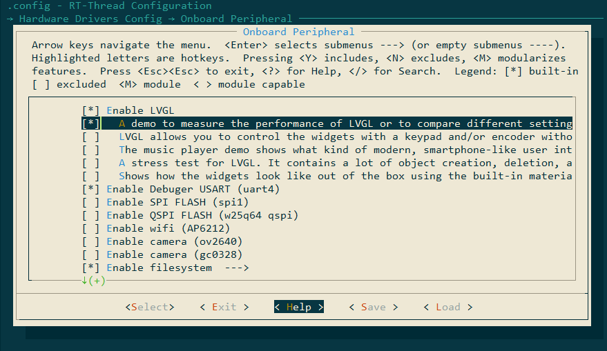
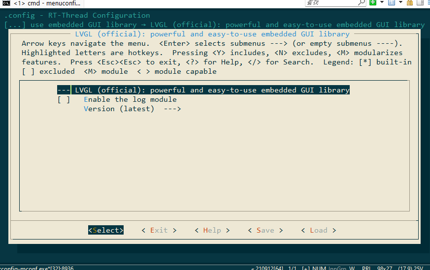

# 基于 ART-PI 的 LVGL-Demos 移植

## 简介

本例程主要功能是在 ART-PI 上运行 LVGL-Demos.

## 硬件说明

本工程主要硬件为 [正点原子 7 寸 RGB 触摸屏](http://www.openedv.com/docs/modules/lcd/7-RGBLCD-1024600.html)， ART-Pi。

## 软件说明

LVGL-Demos 源码位于 libraries/lvgl/demo，共有 5 个 LVGL 官方提供的例程。

在 `lvgl_thread` 线程中，根据不同的宏定义使用不同的 demo。

```c
static void lvgl_thread(void *parameter)
{
#if LV_USE_DEMO_BENCHMARK
    extern void lv_demo_benchmark(void);
    lv_demo_benchmark();
#elif LV_USE_DEMO_STRESS
    void lv_demo_stress(void);
    lv_demo_stress();
#elif LV_USE_DEMO_MUSIC
    extern void lv_demo_music(void);
    lv_demo_music();
#elif LV_USE_DEMO_KEYPAD_AND_ENCODER
    extern void lv_demo_keypad_encoder(void);
    lv_demo_keypad_encoder();
#elif LV_USE_DEMO_WIDGETS
    extern void lv_demo_widgets(void);
    lv_demo_widgets();
#endif

    while(1)
    {
        lv_task_handler();
        rt_thread_mdelay(1);
    }
}
```

## 使用说明

1. 使用 git 工具 clone 本工程：`https://github.com/liukangcc/ART-PI-LVGL-DEMO.git`

2. 在工程目录下打开 env 工具，输入命令 `menuconfig`。

3. 选择一个 demo:

   

4. 选择官方版 lvgl:

   

5. 输入命令 `pkgs --update` 拉取 LVGL 软件包

6. 输入命令 `scons --target=mdk5` 生成 KEIL 工程

7. 打开 keil，编译下载代码。

## 演示效果

LVGL-Demo 在 ART-PI 上的演示效果：

### benchmark

<video src="figures/b96a6ad5826034fc2e7a617a7dad0688.mp4"></video>

## keypad_encoder

<video src="figures/f265e1aa2e13d2b524e1a30463ea5732.mp4"></video>

## music

<video src="figures/b91c9449cde943222e9ac67f9670d4c0.mp4"></video>

## stress

<video src="figures/6171c785a49ddab3b19a7299829f1bc6.mp4"></video>

## widgets

<video src="figures/389e9da2800e4f26e3dc2aff43cbb7c9.mp4"></video>

